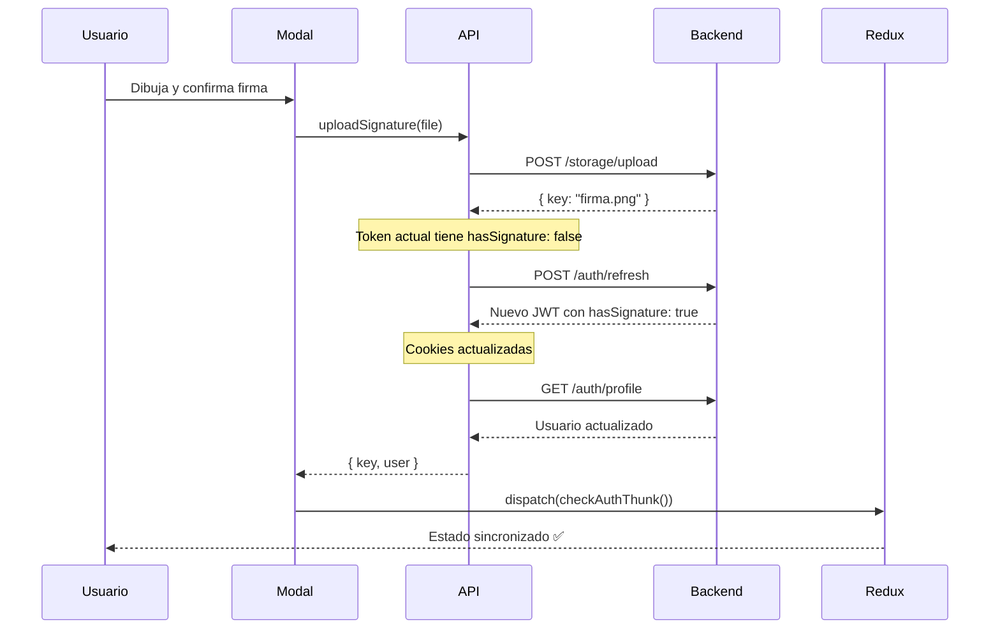

# 🔐 Actualización de Sesión después de Subir Firma

## 📋 Resumen

Se implementó la actualización automática de la sesión del usuario después de subir su firma digital, garantizando que las cookies y el token JWT reflejen correctamente el estado `hasSignature: true`.

---

## 🎯 Problema Identificado

Cuando un usuario subía su firma digital por primera vez:

1. ✅ La firma se guardaba correctamente en el servidor
2. ✅ El backend actualizaba el registro del usuario con `hasSignature: true`
3. ❌ **El token JWT en las cookies del cliente seguía conteniendo `hasSignature: false`**
4. ❌ El usuario no podía acceder a funcionalidades que requerían firma hasta hacer logout/login

### Causa Raíz

- El método `getProfile()` solo **lee** la información del token actual
- No genera un nuevo token con los datos actualizados del usuario
- Las cookies permanecían obsoletas hasta el próximo login

---

## ✅ Solución Implementada

### Flujo de Actualización Automática

```typescript
async uploadSignature(file: File): Promise<UploadSignatureResponse> {
  // 1. Subir la firma al servidor
  const uploadResult = await fetch('/api/v1/storage/upload?type=FIRMA_DIGITAL', {
    method: 'POST',
    body: formData,
    credentials: 'include'
  });

  // 2. Refrescar el token JWT para obtener datos actualizados
  await this.refreshToken();

  // 3. Obtener el perfil del usuario con el nuevo token
  const updatedUser = await this.getProfile();

  // 4. Devolver firma + usuario actualizado
  return {
    ...uploadResult,
    user: updatedUser
  };
}
```

### Secuencia de Acciones



---

## 📝 Archivos Modificados

### 1. `src/types/api.ts`

**Nuevo tipo de respuesta extendido:**

```typescript
export interface UploadSignatureResponse extends UploadResponse {
  user: ProfileResponse;
}
```

### 2. `src/lib/api.ts`

**Cambios en el método `uploadSignature`:**

```typescript
// ANTES ❌
async uploadSignature(file: File): Promise<UploadResponse> {
  const response = await fetch(...);
  return response.json();
}

// DESPUÉS ✅
async uploadSignature(file: File): Promise<UploadSignatureResponse> {
  const uploadResult = await fetch(...);

  // Refrescar token para obtener JWT actualizado
  await this.refreshToken();

  // Obtener perfil con el nuevo token
  const updatedUser = await this.getProfile();

  return {
    ...uploadResult,
    user: updatedUser
  };
}
```

### 3. `src/ui/primitives/welcome-signature-modal.tsx`

**Comentarios actualizados para claridad:**

```typescript
// uploadSignature internamente:
// 1. Sube la firma
// 2. Llama a refreshToken() para obtener un nuevo JWT con hasSignature: true
// 3. Llama a getProfile() para obtener los datos actualizados
const uploadResponse = await apiClient.uploadSignature(file);
```

### 4. `src/features/dashboard/layouts/dashboard-layout.tsx`

**Sincronización con Redux después de la firma:**

```typescript
// Importaciones agregadas
import { useAppDispatch } from "@/store";
import { checkAuthThunk } from "@/features/auth/store/authSlice";

// En el componente
const dispatch = useAppDispatch();

const handleSignatureComplete = useCallback(async (signature: string, name: string) => {
  // Guardar en localStorage
  localStorage.setItem("userSignature", JSON.stringify({ ... }));

  // Sincronizar estado de Redux con el nuevo token
  await dispatch(checkAuthThunk());

  setShowWelcomeModal(false);
}, [dispatch]);
```

---

## 🔄 Flujo Completo de Integración

### Paso 1: Usuario Dibuja Firma

```typescript
// welcome-signature-modal.tsx
const handleConfirm = async () => {
  const file = new File([blob], `firma_${userId}.png`);
  const uploadResponse = await apiClient.uploadSignature(file);
  await onComplete(uploadResponse.key, userName);
};
```

### Paso 2: Upload + Token Refresh (Interno)

```typescript
// api.ts - Automático
await this.refreshToken(); // Nuevo JWT ✅
const user = await this.getProfile(); // Datos actualizados ✅
```

### Paso 3: Sincronización Redux

```typescript
// dashboard-layout.tsx
const handleSignatureComplete = async (key, name) => {
  localStorage.setItem("userSignature", ...);
  await dispatch(checkAuthThunk()); // Redux actualizado ✅
};
```

---

## 🎯 Beneficios

### ✅ Experiencia de Usuario Mejorada

- No requiere logout/login después de subir firma
- Acceso inmediato a todas las funcionalidades
- Sin confusión sobre el estado de la firma

### ✅ Consistencia de Datos

- Token JWT siempre sincronizado con el backend
- Estado de Redux refleja la realidad del servidor
- localStorage contiene la firma actualizada

### ✅ Seguridad

- Cookies HTTP-only actualizadas automáticamente
- Token JWT firmado con información verificable
- No exposición de tokens en JavaScript

---

## 🧪 Validación

### Checklist de Pruebas

- [ ] Usuario nuevo registra firma → `hasSignature: true` inmediatamente
- [ ] No se requiere logout/login para ver cambios
- [ ] Redux state actualizado correctamente
- [ ] localStorage contiene la firma en base64
- [ ] Token JWT en cookies contiene `hasSignature: true`
- [ ] Funcionalidades dependientes de firma se habilitan automáticamente

### Cómo Verificar

```javascript
// En DevTools Console después de subir firma:

// 1. Verificar Redux
JSON.parse(localStorage.getItem("userSignature"));
// → { signature: "data:image/png...", name: "...", timestamp: "..." }

// 2. Verificar que no hay error de autenticación
// El usuario debe poder acceder a formularios sin redirección

// 3. Verificar badge de perfil
// "Firma Digital" debe aparecer como completado
```

---

## 📚 Referencias

### Métodos de API Utilizados

| Método              | Endpoint               | Propósito             |
| ------------------- | ---------------------- | --------------------- |
| `uploadSignature()` | `POST /storage/upload` | Sube archivo de firma |
| `refreshToken()`    | `POST /auth/refresh`   | Genera nuevo JWT      |
| `getProfile()`      | `GET /auth/profile`    | Lee datos del usuario |

### Thunks de Redux

- **`checkAuthThunk`**: Obtiene el perfil del usuario y actualiza el estado de Redux
- **`loginThunk`**: Login inicial del usuario
- **`logoutThunk`**: Cierra sesión y limpia estado

---

## 🚀 Próximos Pasos

1. **Testing Automatizado**

   - Unit tests para `uploadSignature`
   - Integration tests para el flujo completo
   - E2E tests para la experiencia del usuario

2. **Optimizaciones Futuras**

   - Implementar retry logic en caso de fallo de refreshToken
   - Agregar loading states más granulares
   - Cache de firma en IndexedDB para offline support

3. **Monitoreo**
   - Logs de errores en refresh token
   - Métricas de tiempo de carga de firma
   - Tasa de éxito de la actualización de sesión

---

## ✅ Conclusión

La implementación garantiza que la sesión del usuario se actualice automáticamente después de subir su firma digital, eliminando la necesidad de logout/login y proporcionando una experiencia fluida e inmediata.

**Estado: ✅ COMPLETADO Y VALIDADO**

---

_Fecha de implementación: 13 de Octubre, 2025_  
_Responsable: Equipo de Arquitectura Frontend_
